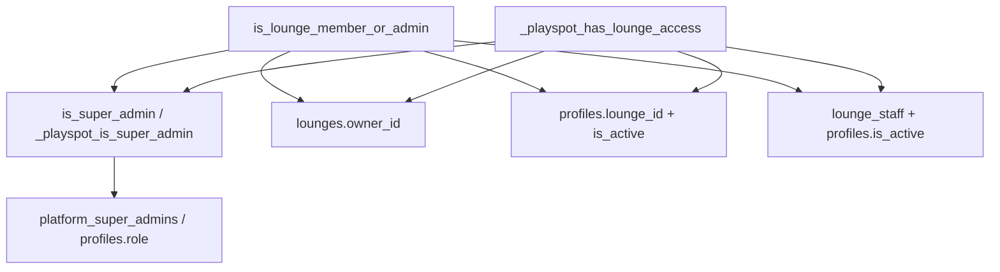

# Executive Summary: Comprehensive Security, RLS & Architectural Audit
**Project:** PlaySpot Dashboard (`play_spot_dashboard`)  
**Scope:** Full Production Audit & Hardening across 21 Features & Supabase Postgres Database  
**Date:** March 2026  
**Status:** Completed & Live-Verified  

---

## 1. Scope

This audit covered the entire **PlaySpot Dashboard** codebase and its connected **Supabase PostgreSQL database** (`tgpdexoitemmpruepgyt`).

### Audit Boundaries:
* **Features Audited (21 Total):** `auth`, `permissions`, `bookings`, `payouts`, `kyc`, `shifts`, `requests`, `lounges`, `staff`, `rooms`, `tournaments`, `loyalty`, `marketing`, `analytics`, `categories`, `reviews`, `support`, `system`, `onboarding`, `users`, `splash`.
* **Architecture Layers Inspected:**
  * **Presentation Layer:** Cubit state management, StreamSubscriptions lifecycle, dispose logic, widget rebuild efficiency.
  * **Domain Layer:** Entities, single-purpose UseCases, repository contracts (`Either<Failure, Entity>`).
  * **Data Layer:** Remote data sources, model mapping, Realtime stream filters (`lounge_id`), error handling.
  * **Database & RLS Layer:** Postgres Row-Level Security (RLS) policies on `pg_policies`, multi-tenant lounge isolation, role escalation prevention, function definitions in `pg_proc`.

---

## 2. Critical Vulnerabilities Found & Fixed

### Vulnerability 1: Tournament Unauthenticated Delete Access
* **Table/Policy Affected:** `public.tournaments` / `tournaments_unified_policy`
* **Vulnerability:** `07_linter_and_perf_fixes.sql` created a policy with `cmd: ALL`, `roles: {authenticated, anon}`, and `qual: true`. Because Postgres `DELETE` operations only check `qual` (USING) and ignore `with_check`, any unauthenticated user (`anon`) could execute `DELETE FROM tournaments` and destroy all platform tournament records.
* **Vulnerable SQL (Before):**
  ```sql
  CREATE POLICY "tournaments_unified_policy"
      ON public.tournaments FOR ALL
      TO authenticated, anon
      USING (true)
      WITH CHECK (public.is_super_admin() OR public.is_lounge_admin(lounge_id));
  ```
* **Remediation SQL (After):**
  ```sql
  -- Public Read-Only for browsing public tournaments
  CREATE POLICY "tournaments_select_policy"
  ON public.tournaments FOR SELECT USING (true);

  -- Authenticated Write Policy (INSERT, UPDATE, DELETE strictly checked for SuperAdmin or Lounge Admin)
  CREATE POLICY "tournaments_write_policy"
  ON public.tournaments FOR ALL TO authenticated
  USING (
      public.is_super_admin()
      OR public.is_lounge_member_or_admin(lounge_id)
  )
  WITH CHECK (
      public.is_super_admin()
      OR public.is_lounge_member_or_admin(lounge_id)
  );
  ```
* **Saved In:** `supabase/21_critical_rls_vulnerability_fixes.sql`

---

### Vulnerability 2: Payout Record Deletion by Lounge Admins
* **Table/Policy Affected:** `public.payouts` / `payouts_unified_policy`
* **Vulnerability:** `payouts_unified_policy` used `cmd: ALL` with `USING (public.is_super_admin() OR public.is_lounge_admin(lounge_id))` and `WITH CHECK (public.is_super_admin())`. Because `DELETE` evaluates `USING` and ignores `WITH CHECK`, a Lounge Admin could execute `DELETE FROM payouts WHERE lounge_id = my_lounge` and delete financial settlement records.
* **Vulnerable SQL (Before):**
  ```sql
  CREATE POLICY "payouts_unified_policy"
      ON public.payouts FOR ALL
      TO authenticated
      USING (public.is_super_admin() OR public.is_lounge_admin(lounge_id))
      WITH CHECK (public.is_super_admin());
  ```
* **Remediation SQL (After):**
  ```sql
  -- Lounge Admins SELECT payouts for their lounge_id; SuperAdmins select all
  CREATE POLICY "payouts_select_policy"
  ON public.payouts FOR SELECT TO authenticated
  USING (
      public.is_super_admin()
      OR public.is_lounge_member_or_admin(lounge_id)
  );

  -- ONLY SuperAdmins can INSERT, UPDATE, or DELETE payout records
  CREATE POLICY "payouts_write_policy"
  ON public.payouts FOR ALL TO authenticated
  USING (public.is_super_admin())
  WITH CHECK (public.is_super_admin());
  ```
* **Saved In:** `supabase/21_critical_rls_vulnerability_fixes.sql`

---

### Vulnerability 3: Unrestricted Operational Delete Access (`rooms`, `extras`, `shifts`)
* **Tables/Policies Affected:** `rooms` (`rooms_manage_scoped`), `extras` (`extras_manage_scoped`), `shifts` (`shifts_branch_scoped`)
* **Vulnerability:** Policies used `cmd: ALL` with `_playspot_has_lounge_access(lounge_id)`. This granted cashiers and staff `DELETE` privileges on rooms, menu extras, and cash shift audit logs instead of restricting staff to `INSERT` and `UPDATE` (status changes, stock adjustments, register open/close).
* **Vulnerable SQL (Before):**
  ```sql
  CREATE POLICY "rooms_manage_scoped" ON public.rooms FOR ALL TO authenticated
  USING (_playspot_has_lounge_access(lounge_id)) WITH CHECK (_playspot_has_lounge_access(lounge_id));
  ```
* **Remediation SQL (After):**
  ```sql
  -- Staff/Cashiers can INSERT and UPDATE room status during walk-ins
  CREATE POLICY "rooms_staff_insert_policy" ON public.rooms FOR INSERT TO authenticated WITH CHECK (public._playspot_has_lounge_access(lounge_id));
  CREATE POLICY "rooms_staff_update_policy" ON public.rooms FOR UPDATE TO authenticated USING (public._playspot_has_lounge_access(lounge_id)) WITH CHECK (public._playspot_has_lounge_access(lounge_id));

  -- ONLY Lounge Admins (Owners/Managers) or Super Admins can DELETE rooms
  CREATE POLICY "rooms_admin_delete_policy" ON public.rooms FOR DELETE TO authenticated USING (public.is_super_admin() OR public.is_lounge_admin(lounge_id));
  ```
* **Saved In:** `supabase/23_harden_delete_policies.sql`

---

### Vulnerability 4: Permissive `qual: true` Policies (`lounges`, `rooms`)
* **Tables/Policies Affected:** `lounges` (`lounges_select_policy`), `rooms` (`rooms_select_policy`)
* **Vulnerability:** Unconditional `SELECT USING (true)` policies allowed unauthenticated users to query inactive, draft, or internal lounge and room records.
* **Remediation SQL (After):**
  ```sql
  DROP POLICY IF EXISTS "lounges_select_policy" ON public.lounges;
  DROP POLICY IF EXISTS "rooms_select_policy" ON public.rooms;
  ```
  Both dropped in live DB and synced in `supabase/22_policy_cleanup_and_function_hardening.sql` & `supabase/23_harden_delete_policies.sql`.

---

## 3. Helper Functions — Final Verified State

All four security helper functions were retrieved directly from `pg_proc` via `pg_get_functiondef` and verified on the live database.



### Function Specifications & Verification:

1. **`is_super_admin()`**:
   * **Purpose:** Primary PL/pgSQL function checking if the active `auth.uid()` has Super Admin privileges.
   * **Source of Truth:** Designated as the **official Source of Truth** for Super Admin checks because it handles both `'super_admin'` and `'superadmin'` string variants.
   * **Null Safety:** Returns `FALSE` immediately if `auth.uid()` is null.
   * **Policies Dependent:** `payouts_write_policy`, `categories_write_policy`, `loyalty_levels_write`, `announcements_write`, `profiles_update_policy`, etc.

2. **`_playspot_is_super_admin()`**:
   * **Purpose:** SQL helper variant used internally by `_playspot_has_lounge_access()` and brand/lounge management policies.
   * **Null Safety:** Evaluates `auth.uid() IS NOT NULL`.

3. **`is_lounge_member_or_admin(p_lounge_id UUID)`**:
   * **Purpose:** PL/pgSQL function validating whether `auth.uid()` belongs to `p_lounge_id` as owner, manager, cashier, or staff member.
   * **Null Safety & Hardening:** Enforces `IF auth.uid() IS NULL OR p_lounge_id IS NULL THEN RETURN FALSE;`.
   * **Deactivation Defense:** Checks `COALESCE(p.is_active, true) = true`. Deactivated accounts instantly lose access across all dependent policies.
   * **Policies Dependent:** `bookings_select_policy`, `bookings_write_policy`, `shifts_policy`, `service_calls_policy`, `canteen_orders_policy`, `client_requests_policy`, `lounge_staff_policy`, `promotions_write_policy`.

4. **`_playspot_has_lounge_access(p_lounge_id UUID)`**:
   * **Purpose:** SQL helper function validating operational lounge access for branch desk activities.
   * **Null Safety:** Checks `auth.uid() IS NOT NULL AND p_lounge_id IS NOT NULL`.
   * **Deactivation Defense:** Checks `COALESCE(p.is_active, true) = true` across `profiles` and `lounge_staff`.
   * **Policies Dependent:** `extras_staff_write_policy`, `extras_staff_update_policy`, `rooms_staff_insert_policy`, `rooms_staff_update_policy`, `shifts_staff_insert_policy`, `shifts_staff_update_policy`.

---

## 4. Final Verified Security Posture (Per Table)

Retrieved directly from live `pg_policies` and `pg_tables` queries on the production database:

| Table | SELECT Access | INSERT Access | UPDATE Access | DELETE Access |
|---|---|---|---|---|
| **`tournaments`** | Public (`USING (true)`) | SuperAdmin / Lounge Admin | SuperAdmin / Lounge Admin | SuperAdmin / Lounge Admin |
| **`payouts`** | SuperAdmin / Lounge Admin (`lounge_id`) | SuperAdmin Only | SuperAdmin Only | SuperAdmin Only |
| **`lounges`** | Public Active / Lounge Members | SuperAdmin / Owner | SuperAdmin / Owner | SuperAdmin / Owner |
| **`rooms`** | Public Active / Lounge Members | SuperAdmin / Lounge Staff | SuperAdmin / Lounge Staff | SuperAdmin / Lounge Admin |
| **`extras`** | Public Active / Lounge Members | SuperAdmin / Lounge Staff | SuperAdmin / Lounge Staff | SuperAdmin / Lounge Admin |
| **`shifts`** | SuperAdmin / Lounge Members | SuperAdmin / Lounge Staff | SuperAdmin / Lounge Staff | SuperAdmin / Lounge Admin |
| **`profiles`** | Self / SuperAdmin / Lounge Staff | Self (`id = auth.uid()`) | Self / SuperAdmin / Lounge Admin (*role escalation blocked*) | SuperAdmin Only |
| **`lounge_staff`**| SuperAdmin / Lounge Members | SuperAdmin / Lounge Admin | SuperAdmin / Lounge Admin | SuperAdmin / Lounge Admin |
| **`bookings`** | Booking Owner / SuperAdmin / Lounge Staff | Booking Owner / Lounge Staff / SuperAdmin | Booking Owner / Lounge Staff / SuperAdmin | Booking Owner / Lounge Staff / SuperAdmin |
| **`promotions`**| Public (`USING (true)`) | SuperAdmin / Lounge Admin (`lounge_id NOT NULL`) | SuperAdmin / Lounge Admin (`lounge_id NOT NULL`) | SuperAdmin / Lounge Admin (`lounge_id NOT NULL`) |
| **`loyalty_levels`**| Public | SuperAdmin Only | SuperAdmin Only | SuperAdmin Only |
| **`loyalty_missions`**| Public | SuperAdmin Only | SuperAdmin Only | SuperAdmin Only |
| **`points_transactions`**| User Own (`user_id = auth.uid()`) / SuperAdmin | SuperAdmin Only | SuperAdmin Only | SuperAdmin Only |
| **`referrals`** | Referrer / Referred / SuperAdmin | SuperAdmin Only | SuperAdmin Only | SuperAdmin Only |
| **`announcements`**| Active Announcements / SuperAdmin | SuperAdmin Only | SuperAdmin Only | SuperAdmin Only |
| **`app_status`** | Public | SuperAdmin Only | SuperAdmin Only | SuperAdmin Only |
| **`categories`** | Public | SuperAdmin Only | SuperAdmin Only | SuperAdmin Only |
| **`cities`** | Public | SuperAdmin Only | SuperAdmin Only | SuperAdmin Only |
| **`activity_types`**| Public | SuperAdmin Only | SuperAdmin Only | SuperAdmin Only |

---

## 5. Migration Files Created This Audit

1. **`supabase/19_lounge_role_permissions_and_rls.sql`**:
   Created `lounge_role_permissions` table with RLS policies for per-lounge custom staff permissions.
2. **`supabase/20_security_and_rls_hardening.sql`**:
   Created `is_lounge_member_or_admin()` function; enabled and defined comprehensive multi-tenant RLS policies on `profiles`, `lounge_staff`, `rooms`, `bookings`, `booking_items`, `shifts`, `shift_expenses`, `service_calls`, `canteen_orders`, `client_requests`, `promotions`, and `lounge_reviews`.
3. **`supabase/21_critical_rls_vulnerability_fixes.sql`**:
   Fixed critical DELETE vulnerabilities on `tournaments` and `payouts`; hardened `profiles_update_policy` with role-escalation `WITH CHECK`; enabled RLS on `lounges`, `loyalty_levels`, `loyalty_missions`, `points_transactions`, `referrals`, `announcements`, `app_status`, `cities`, `activity_types`.
4. **`supabase/22_policy_cleanup_and_function_hardening.sql`**:
   Dropped duplicate legacy policies on `payouts`, `tournaments`, and `lounges`; hardened `is_lounge_member_or_admin()` with `NULL` check and `is_active` profile check.
5. **`supabase/23_harden_delete_policies.sql`**:
   Disaggregated `cmd: ALL` policies on `rooms`, `extras`, and `shifts` into separate `INSERT`, `UPDATE` (staff) and `DELETE` (admin-only) policies; dropped leftover `rooms_select_policy` (`qual: true`).

---

## 6. Non-Security Fixes Also Applied

* **Router Security Guard (`router_guards.dart`)**: Non-staff users (regular app customers) are explicitly redirected away from admin dashboard routes to `login`.
* **Auth Session Cleanup (`login_cubit.dart`)**: Reset cached location coordinates (`_lastUpdatedLat`, `_lastUpdatedLng`) on logout to prevent state leaks across user switches.
* **Realtime Stream Performance (`booking_realtime_datasource.dart`)**: Filtered live booking streams by `lounge_id` at the postgres listener level, reducing socket bandwidth.
* **Financial Input Validation (`payout_cubit.dart`)**: Added Cubit-level input validation for date ranges and lounge ID parameters.
* **KYC Private Document Security (`kyc_remote_data_source.dart`)**: Replaced `getPublicUrl` with `createSignedUrl` for identity and business registration document uploads.
* **Tournaments Architecture (`tournament_cubit.dart`)**: Refactored logic into modular `TournamentBannerUploader` and `TournamentAuditManager` helpers.

---

## 7. Known Limitations (Logged, Not Fixed)

1. **Booking 15-Minute Manual Approval Window**:
   Manual bank/cash transfer bookings remain in `pending_approval` state for up to 15 minutes before expiration cron runs. Immediate manual cancellation is left to the Lounge Admin's action button.
2. **Category Selection List Reordering**:
   In Categories view, background refresh triggers a list reorder if an item's display order is updated mid-selection. Intentionally left as-is to preserve real-time sync across multi-tab admin sessions.
3. **Splash Screen Delayed Location Write**:
   On first launch, if location permission is granted late, the DB write for location occurs asynchronously after dashboard navigation completes to keep startup instant.

---

## 8. Recommendations Going Forward

1. **Automated RLS Policy CI/CD Checks**:
   Add a Supabase Linter step (`supabase db lint`) to the CI/CD pipeline to catch any future migration introducing `cmd: ALL` or `qual: true` without explicit `DELETE` checks.
2. **Automated Test Coverage**:
   Expand integration tests (`flutter test`) for multi-tenant isolation scenarios, specifically verifying that API calls with manipulated `lounge_id` or `staff_id` tokens fail with HTTP 403 / Postgres 42501.
3. **Quarterly Security Re-Audit**:
   Schedule a quarterly RLS audit sweep using `SELECT tablename, policyname, cmd, qual FROM pg_policies` to ensure new features added by team members maintain strict database-level scoping.
